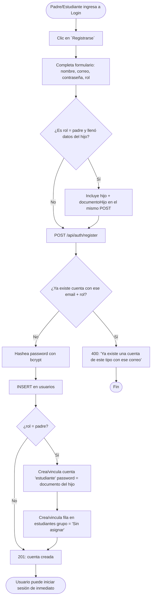
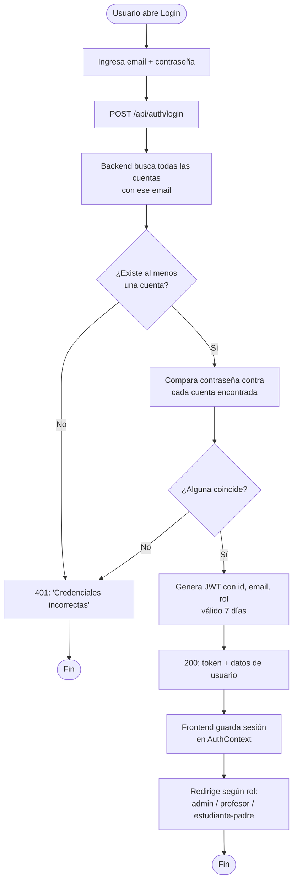
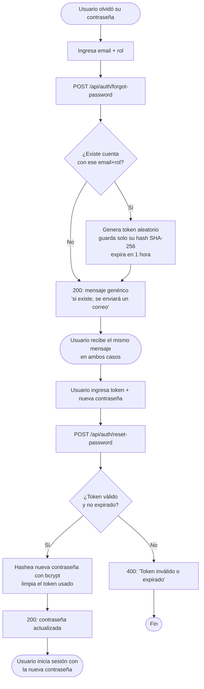
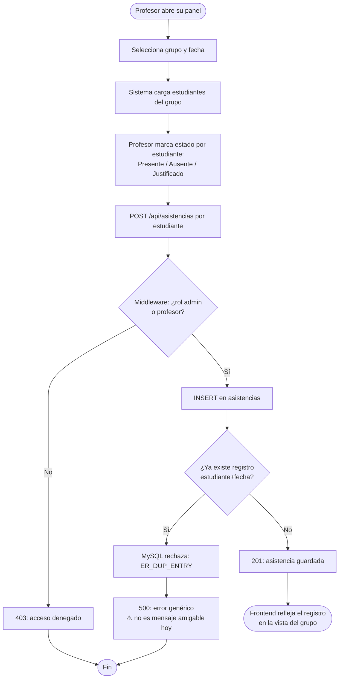
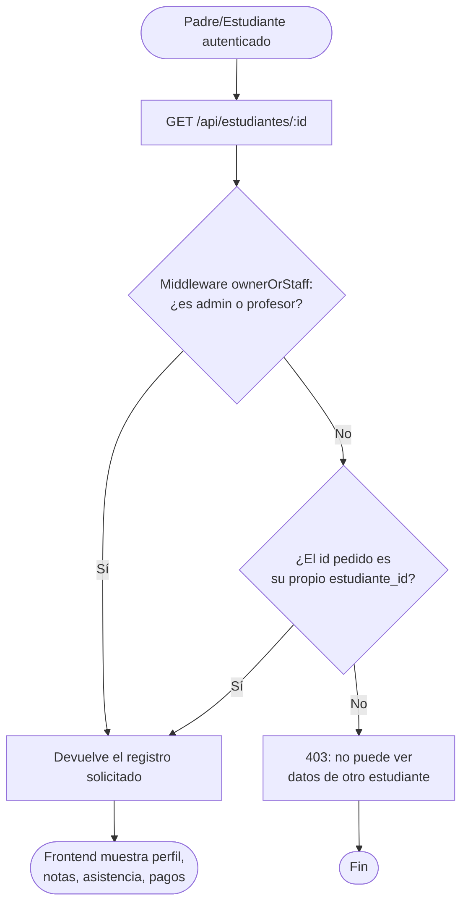

# Diagramas de Actividad — Escuela Deportiva IERD Duitama

## 1. Registro de usuario (padre + estudiante)

## 2. Inicio de sesión

---

## 3. Recuperación de contraseña

---

## 4. Registro de asistencia (regla de negocio RN-01)

---

## 5. Consulta propia (padre/estudiante) — regla `ownerOrStaff`

> ⚠️ Nota honesta: esta protección `ownerOrStaff` solo está implementada en `GET /estudiantes/:id`. Las listas `GET /pagos`, `GET /asistencias` y `GET /notas` **no** tienen este filtro — solo exigen estar autenticado (ver `rf_por_capa.md`, deuda técnica #2).    

