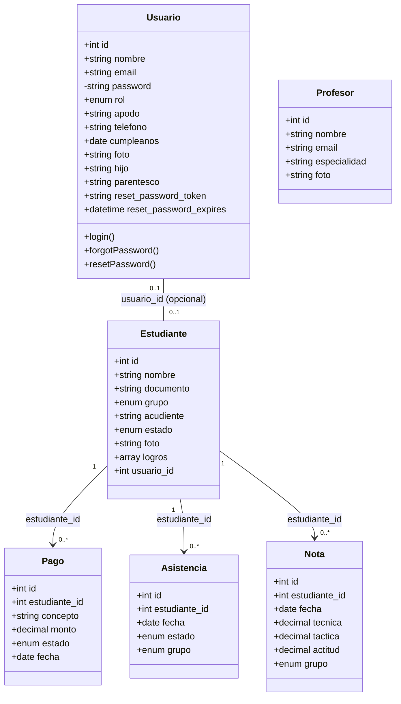
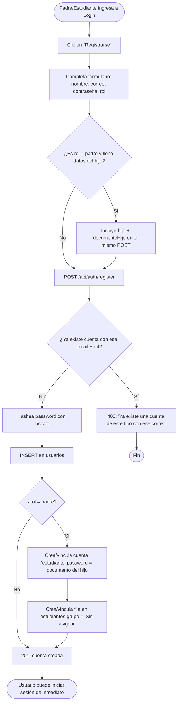

# Diagramas Corregidos — Escuela Deportiva IERD Duitama

## 0. Diagnóstico de los diagramas originales

| Diagrama subido | Qué describe | Problema |
|---|---|---|
| Imagen 1 (clases: Usuario/Ciudadano/Entrenador/Parque/EscenarioDeportivo) | Un sistema municipal de reserva de escenarios deportivos | **No implementado.** No existen `Parque`, `EscenarioDeportivo`, `ActividadDeportiva`, `Ciudadano` en el backend. |
| Imagen 2 (actividad: inscripción con aprobación de admin) | Flujo de solicitud → revisión de soportes → aprobación/rechazo → correo con credenciales | **No implementado.** El registro real es inmediato (self-service), sin estado "Pendiente" ni revisión manual. |
| Imagen 3 (clases: Torneo/Partido/Sede/Noticia/Multimedia/Comentario) | Un sistema de gestión de torneos y noticias | **No implementado.** Ninguna de esas 7 entidades existe en las migraciones reales. |

Los tres corresponden al **mismo problema** que ya identificamos en `diccionario_datos.md` original: son la visión inicial/ambiciosa del proyecto, no el MVP que terminó construyéndose. Corregirlos significa **reemplazarlos** por lo que sí hay, no "ajustar" los que ya existen.

---

## 1. Diagrama de clases corregido

**Diferencias clave respecto a los diagramas originales:**
- No hay herencia (`Usuario ← Ciudadano/Entrenador` con `▲`). En el modelo real, **`Profesor` es una tabla independiente**, no una subclase de `Usuario` — un profesor no necesariamente tiene cuenta de acceso propia en la tabla `usuarios` (no hay FK entre ellas).
- `Usuario` y `Estudiante` **no son la misma clase ni están en herencia** — son entidades separadas unidas por una FK opcional (`usuario_id`), porque un estudiante puede existir sin cuenta.
- No hay métodos de negocio dentro de las clases (`calcularEdad()`, `verificarCupos()`, etc.) porque el backend no tiene capa de dominio con objetos — cada controlador hace SQL directo (ya documentado en `modelo-de-dominio.md`).

---

## 2. Diagrama de actividad corregido — Registro de usuario

**Diferencias clave respecto al diagrama original:**
- **No existe estado "Pendiente"** ni revisión de un administrador. El registro es inmediato: al enviar el formulario, la cuenta queda activa y se puede iniciar sesión al instante.
- **No hay carga de soportes/documentos** (`documentoSoporteUrl` del diagrama original no existe en el backend).
- **No se envía correo con credenciales** — la contraseña la elige el usuario mismo (o, para el hijo, se deriva automáticamente del documento de identidad, sin acción manual del admin).
- La única "aprobación" que sí existe post-registro es que el estudiante queda en grupo `Sin asignar` hasta que el staff (admin/profesor) le asigne uno real — pero eso ocurre editando el estudiante (`PUT /api/estudiantes/:id`), no en un flujo de aprobación dedicado.

---

## 3. Cómo funcionan estos diagramas en el aplicativo

**Clases → Migraciones → Controladores.** Cada clase del diagrama corregido es literalmente una tabla en `backend/migrations/`, y cada método que sí existe en el sistema real (login, forgotPassword, resetPassword) es una función exportada en `authController.cjs`, llamada desde `authRoutes.cjs`. No hay una capa de "objetos" intermedia — el diagrama de clases aquí describe el **modelo de datos**, no clases de código ejecutándose en memoria.

**Actividad → Endpoint único.** Todo el flujo de registro corregido ocurre dentro de **una sola llamada HTTP** (`POST /api/auth/register`) que ejecuta internamente hasta 3 `INSERT` (usuario padre, usuario estudiante, estudiante) de forma secuencial en el mismo request — no son pasos separados en el tiempo como sugiere un flujo de aprobación multi-actor.

---

## 4. Cómo sustentar la diferencia (esto es lo importante)

No lo presentes como "error corregido" — preséntalo como **evolución del alcance**, que es justo lo que la guía SENA valora (sección 31, deuda técnica; sección 40, comprensión sobre cantidad):

> "El diseño inicial contemplaba un sistema más amplio — reserva de escenarios deportivos y gestión de torneos — con un flujo de aprobación administrativa para las inscripciones. Durante el desarrollo priorizamos el MVP: autenticación, roster de estudiantes, asistencia, notas y pagos, porque sin eso no había producto usable. El flujo de registro se simplificó a autoservicio inmediato porque el volumen real de la escuela no justificaba una cola de aprobación manual en esta primera versión."

Preguntas que te pueden hacer sobre esto, y cómo responderlas:

- **"¿Por qué el diagrama no coincide con el código?"** → Porque el diagrama documentaba la intención original; se corrigió para reflejar el MVP realmente construido, siguiendo el principio de la guía de que cada artefacto debe responder qué se construyó y por qué (sección 44).
- **"¿Por qué el profesor no hereda de Usuario?"** → Porque no todo profesor necesita cuenta de acceso al sistema; separarlos evita forzar una fila en `usuarios` para alguien que solo aparece como dato de referencia.
- **"¿Qué pasaría si retomaran el flujo de aprobación?"** → Se necesitaría un campo `estado` en el registro (`pendiente/aprobado/rechazado`), un endpoint de revisión para admin, y notificación por correo — está fuera del alcance actual pero es backlog razonable, no una funcionalidad rota.
